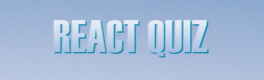

   

 

### 💻 Sobre o projeto

---

Projeto é um quiz, feito em ReactJS e TypeScript. Busca as trivias da API "Open Trivia DataBase" (link na sessão ferramentas).
Foi criado a partir do vídeo-tutorial "React / Typescript Tutorial - Build a Quiz App" do canal "FreeCodeCamp" (link na sessão Material Base).

---

### 🛠🛠 Tecnologias utilizadas

---

As seguintes ferramentas foram usadas na construção do projeto:

- **[React](https://reactjs.org/)**
- **[Styled Components](https://github.com/styled-components/styled-components)**
- **[TypeScript](https://www.typescriptlang.org/)**
- **[API Open Trivia DataBase](https://opentdb.com/api_config.php)**

> Veja o arquivo [package.json](https://github.com/fagnerzulin/quiz-react-app/blob/main/package.json)

---

### 👩‍🏫👨‍🏫 Material Base

---

Para acessar o vídeo que ensina a montar esse projeto acesse: **[React / Typescript Tutorial - Build a Quiz App](https://www.youtube.com/watch?v=F2JCjVSZlG0)**. Para conhecer a plataforma de ensino gratuito acesse **[FreeCodeCamp](https://www.freecodecamp.org/learn/)**

---
